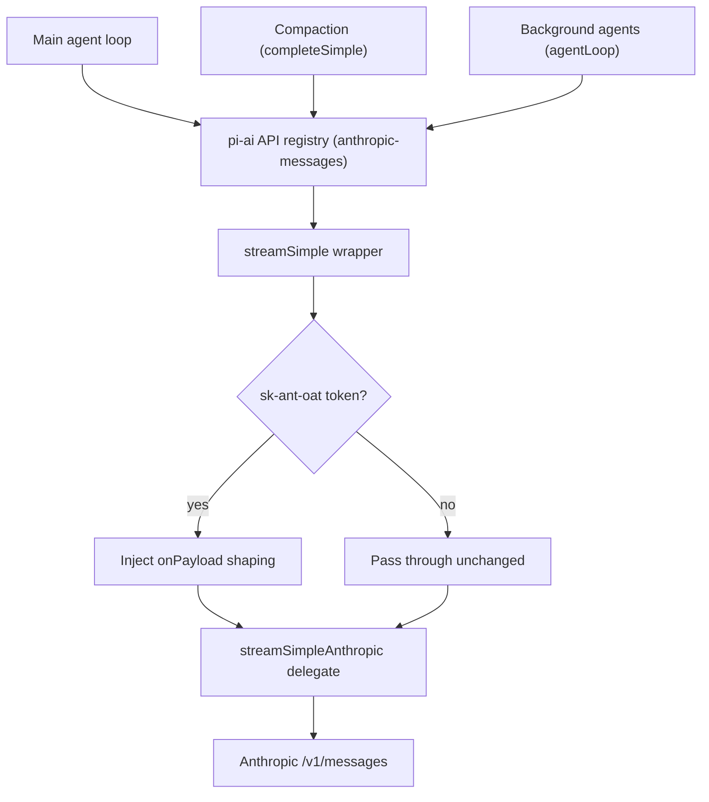

# Architecture

This document explains how `pi-anthropic-auth` applies Anthropic Claude Pro/Max OAuth compatibility shaping, and why it does so at Pi's transport layer rather than through an event hook.

## Overview

The extension re-registers Pi's built-in `anthropic` provider with two things:

1. an `oauth` override that reuses Pi's native Anthropic login and hardens token refresh, and
2. a thin `streamSimple` transport wrapper that shapes outgoing OAuth requests.

The wrapper is the single shaping point.
It delegates to Pi's own `streamSimpleAnthropic` and only injects an `onPayload` step, so it does not reimplement Pi's Anthropic transport.

## The problem: a hook-coverage gap

Earlier versions shaped requests in a `before_provider_request` handler.
That hook is threaded into the interactive agent loop's `streamFn` only.

Auxiliary Anthropic OAuth calls bypass it:

- Pi's built-in compaction/summarization issues `completeSimple` without an `onPayload`.
- Third-party background agents (for example pi-observational-memory's observer, reflector, and dropper) run via `agentLoop`, which defaults to pi-ai's bare `streamSimple`.

Those requests reached Anthropic carrying an OAuth token but no Claude Code billing header.
Anthropic then classified them as third-party app usage and returned the misleading `You're out of extra usage.` HTTP 400 reported in Issue #18 with `pi-fork` and `pi-observational-memory`.

## The seam: a `streamSimple` transport wrapper

Pi's `registerProvider({ api, streamSimple })` routes through pi-ai's singleton API registry (`registerApiProvider`).
Every Anthropic request resolves its transport from that registry via `getApiProvider("anthropic-messages")`, regardless of which code path issued it.

Registering a `streamSimple` wrapper therefore intercepts all of them in-process:

The wrapper delegates to Pi's built-in `streamSimpleAnthropic`, imported directly from `@earendil-works/pi-ai/anthropic` rather than read out of the API registry.
Importing it directly avoids both the recursion risk (delegating to the registered wrapper would recurse infinitely) and the pi-ai 0.79.8 lazy-registration clobber: the registry's `anthropic-messages` entry is a lazy stub whose first call re-registers the bare built-in via `registerApiProvider`, overwriting this wrapper (Issue #28).

## OAuth gating

Shaping is gated on the resolved API key, available to the transport as `options.apiKey`.
Anthropic OAuth access tokens carry an `sk-ant-oat` prefix, which is the same signal Pi's built-in provider uses internally to decide whether to emit Claude Code identity headers.

When the token is not an Anthropic OAuth token, the payload passes through untouched.
This replaces the previous, brittle approach of sniffing system-prompt markers and keeps API-key and non-Anthropic requests on Pi's normal path.

## What the wrapper does

For OAuth requests, the injected `onPayload` runs `shapeAnthropicOAuthPayload`, which:

1. normalizes assistant message ordering when Pi serializes `[tool_use..., text]` for Anthropic,
2. sanitizes Pi's default preamble by anchor (de-fingerprinting) — removing the identity, custom-tool filler, and Pi documentation paragraphs, replacing only the identity with a minimal neutral prompt, and preserving tool snippets, guidelines, and appended content — and
3. prepends an `x-anthropic-billing-header` system block (without `cache_control`).

The wrapper composes, rather than replaces, any caller-provided `onPayload`.
On the main loop, Pi still passes its own `onPayload` (which fires other extensions' `before_provider_request` handlers); the wrapper runs those first and applies our shaping last, closest to the wire.

## Call paths covered

| Call path | Issued by | Reaches `before_provider_request` | Reaches the wrapper |
| --- | --- | --- | --- |
| Interactive turn | agent loop `streamFn` | yes | yes |
| Compaction / summarization | `completeSimple` | no | yes |
| Background agents | `agentLoop` default `streamSimple` | no | yes |
| Fork children | a separate `pi` process | per-process | yes (if the child loads this extension) |

## What stays untouched

- Non-Anthropic providers (different `api`, so the token gate short-circuits to pass-through).
- Plain Anthropic API-key requests (no `sk-ant-oat` token).
- Pi's built-in Anthropic model list (no `models` are registered).
- Pi's native `/login anthropic` flow (handled by the `oauth` override).

## Related files

- `src/index.ts` — imports `streamSimpleAnthropic` directly and registers the OAuth override plus `streamSimple` wrapper.
- `src/oauth-transport.ts` — the token-gated `streamSimple` wrapper.
- `src/request-shaping.ts` — the shaping pipeline applied via `onPayload`.
- `src/system-prompt-shaping.ts` — anchor-driven preamble sanitizer that preserves tool snippets, guidelines, and appended content.
- `src/anthropic-oauth.ts` — OAuth login override and refresh fallback.
