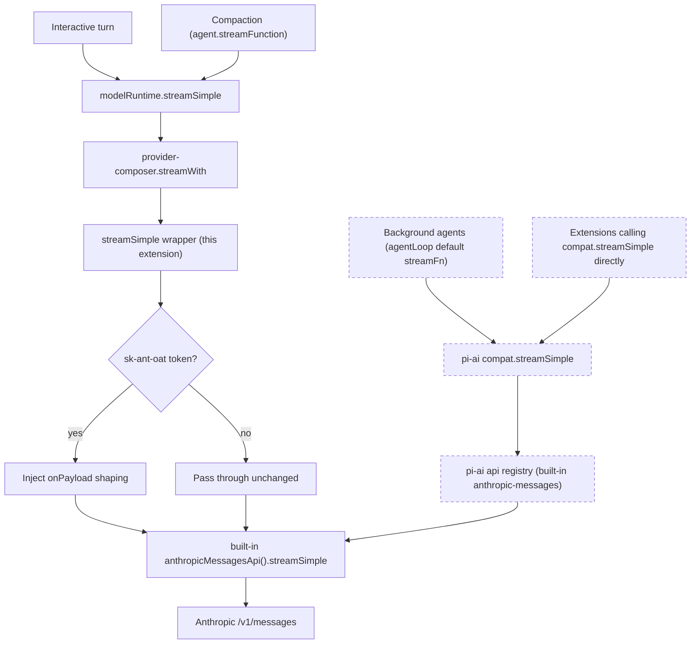

# Architecture

This document explains how `pi-anthropic-auth` applies Anthropic Claude Pro/Max OAuth compatibility shaping, and why it does so at Pi's transport layer rather than through an event hook.

## Overview

The extension re-registers Pi's built-in `anthropic` provider with a thin `streamSimple` transport wrapper that shapes outgoing OAuth requests.
Login and refresh are delegated to Pi's built-in `anthropicOAuth` (the extension omits `oauth`, and `composeModelProvider` falls back to the built-in auth).

The wrapper is the single shaping point.
It delegates to Pi's own built-in Anthropic `streamSimple` transport and only injects an `onPayload` step, so it does not reimplement Pi's Anthropic transport.

## The problem: a hook-coverage gap

Earlier versions shaped requests in a `before_provider_request` handler.
That hook is threaded into the interactive agent loop's `streamFn` only.

Auxiliary Anthropic OAuth calls bypass it:

- Pi's built-in compaction/summarization issues `completeSimple` without an `onPayload`.
- Third-party background agents (for example pi-observational-memory's observer, reflector, and dropper) run via `agentLoop`, which defaults to pi-ai's bare `streamSimple`.

Those requests reached Anthropic carrying an OAuth token but no Claude Code billing header.
Anthropic then classified them as third-party app usage and returned the misleading `You're out of extra usage.` HTTP 400 reported in Issue #18 with `pi-fork` and `pi-observational-memory`.

The transport wrapper closed the compaction half of that gap and, on pi <=0.80.7, the background-agent half as well.
pi 0.80.8 reopened the background-agent half; see "The remaining gap: pi-ai compat dispatch" below.

## The seam: a `streamSimple` transport wrapper

Pi's `registerProvider({ api, streamSimple })` stores the config in pi's own `extensionProviders` map.
`provider-composer.ts`'s `streamWith` then applies it whenever a request arrives through `modelRuntime`:

```ts
if (extension?.streamSimple && model.api === extension.api) {
  return extension.streamSimple(model, context, options as SimpleStreamOptions);
}
```

Both the interactive loop and compaction dispatch through `modelRuntime`, so both reach the wrapper.
`sdk.ts`'s `createAgentSession` supplies `streamFn: (model, context, options) => modelRuntime.streamSimple(...)`, and `agent-session.ts` reuses that same `agent.streamFunction` at both compaction call sites.

Callers that dispatch through pi-ai's own `compat.streamSimple` do not reach the wrapper at all:


```mermaid
flowchart TD
    A["Interactive turn"] --> MR["modelRuntime.streamSimple"]
    B["Compaction (agent.streamFunction)"] --> MR
    MR --> PC["provider-composer.streamWith"]
    PC --> W["streamSimple wrapper (this extension)"]
    W --> D{"sk-ant-oat token?"}
    D -->|"yes"| S["Inject onPayload shaping"]
    D -->|"no"| P["Pass through unchanged"]
    S --> G["built-in anthropicMessagesApi().streamSimple"]
    P --> G
    G --> AN["Anthropic /v1/messages"]

    C["Background agents (agentLoop default streamFn)"] --> CD["pi-ai compat.streamSimple"]
    X["Extensions calling compat.streamSimple directly"] --> CD
    CD --> R["pi-ai api registry (built-in anthropic-messages)"]
    R --> G

    classDef gap stroke-dasharray: 5 4
    class C,X,CD,R gap
```

The dashed lane is unshaped: it reaches the same built-in transport, but without the billing header.

The wrapper delegates to Pi's built-in Anthropic `streamSimple` transport, resolved at runtime by `src/host-transport.ts` rather than read out of the API registry.
`anthropicMessagesApi()` is the direct, non-deprecated handle pi's own `custom-provider-gitlab-duo` example delegates through, and reading from a registry this extension does not participate in would bind the delegate to whatever another extension registered there last.
On pi <=0.80.7 the rationale was stronger still: `registerProvider` wrote our wrapper into that registry, so reading the delegate back out of it would have recursed.
The related Issue #28 lazy-registration clobber is precluded by the `>=0.80.8` peer floor.
The resolver imports `@earendil-works/pi-ai/compat` — the subpath pi's own `custom-provider-gitlab-duo` example delegates through — and prefers the non-deprecated `anthropicMessagesApi().streamSimple` factory, falling back to the deprecated `streamSimpleAnthropic` alias for older hosts.
On pi >=0.80.8 the host loader aliases (Node) / virtualizes (Bun) both the bare `@earendil-works/pi-ai` specifier and the `/compat` subpath to its bundled compat entrypoint (`dist/compat.js`); the subpath names the surface we actually depend on.
A loader-aliased specifier is required because `import.meta.resolve` and non-aliased subpath imports bypass that host indirection: jiti consults its `alias`/`virtualModules` maps on the import path but not on the `resolve` path, so the former `import.meta.resolve("@earendil-works/pi-ai")` plus derived `dist/...` file import fell through to filesystem resolution from the extension's own directory and failed when pi-ai was absent from it — the `pi install` and Bun-binary cases (Issue #31).
The #35 seam concern is resolved in practice: the loader aliases `/compat` in both modes and pi ships this delegation pattern as an official example.
The residual watch is the eventual `compat` removal, at which point `anthropicMessagesApi()` relocates off the compat entrypoint (Issue #35).

## OAuth gating

Shaping is gated on the resolved API key, available to the transport as `options.apiKey`.
Anthropic OAuth access tokens carry an `sk-ant-oat` prefix, which is the same signal Pi's built-in provider uses internally to decide whether to emit Claude Code identity headers.

When the token is not an Anthropic OAuth token, the payload passes through untouched.
This replaces the previous, brittle approach of sniffing system-prompt markers and keeps API-key and non-Anthropic requests on Pi's normal path.

## What the wrapper does

For OAuth requests, the injected `onPayload` runs `shapeAnthropicOAuthPayload`, which:

1. normalizes assistant message ordering when Pi serializes `[tool_use..., text]` for Anthropic,
2. sanitizes Pi's default preamble by anchor (de-fingerprinting) — removing the identity, custom-tool filler, and Pi documentation paragraphs, replacing only the identity with a minimal neutral prompt, and preserving tool snippets, guidelines, and appended content — and
3. prepends an `x-anthropic-billing-header` system block (without `cache_control`).

The wrapper composes, rather than replaces, any caller-provided `onPayload`.
On the main loop, Pi still passes its own `onPayload` (which fires other extensions' `before_provider_request` handlers); the wrapper runs those first and applies our shaping last, closest to the wire.

## Call paths covered

| Call path | Issued by | Reaches `before_provider_request` | Reaches the wrapper |
| --- | --- | --- | --- |
| Interactive turn | agent loop `streamFn`, into `modelRuntime` | yes | yes |
| Compaction / summarization | `agent.streamFunction`, into `modelRuntime` | no | yes |
| Background agents | `agentLoop` default `streamFn`, into `compat.streamSimple` | no | no |
| Direct `compat.streamSimple` callers | a third-party extension | no | no |
| Fork children | a separate `pi` process | per-process | for that process's own `modelRuntime` traffic |

## The remaining gap: pi-ai compat dispatch

pi's SDK still hands pi-ai's `compat.streamSimple` to callers that supply no stream function of their own:

```ts
// packages/coding-agent/src/core/sdk.ts
// Preserve the pre-0.81 fallback for extensions that construct Agent instances
// or invoke low-level agent loops without supplying streamFn.
setDefaultStreamFn(streamSimple);
```

That default resolves the transport from pi-ai's api registry, which still holds the built-in Anthropic transport.
Up to pi 0.80.7, `ModelRegistry.applyProviderConfig` bridged an extension's `streamSimple` into that registry via `registerApiProvider`, so those calls reached the wrapper too.
pi 0.80.8 replaced `ModelRegistry` with `ModelRuntime` and dropped the bridge; no file in `pi-coding-agent`'s `dist/` has called `registerApiProvider` since.
Because 0.80.8 is this package's peer floor, the bridge is absent on every host version this extension supports.

An Anthropic OAuth request on that lane carries no Claude Code billing header and comes back as `You're out of extra usage.` — a billing message for what is really a coverage gap.

### Why this extension does not close it

The obvious fix is to call `registerApiProvider` ourselves.
It would work mechanically: `compat`'s built-in fast path is guarded by an identity check against the registry, so any override makes the check fail and dispatch falls through to us.

It is not done because the registry is keyed by **api**, not by provider, and `registerApiProvider` is a `Map.set`.
There is one `anthropic-messages` slot, shared by ten built-in providers: `anthropic`, `cloudflare-ai-gateway`, `fireworks`, `github-copilot`, `kimi-coding`, `minimax`, `minimax-cn`, `opencode`, `opencode-go`, and `vercel-ai-gateway`.
Registering an override unconditionally diverts all ten off the built-in provider branch on the compat lane:

| Case | Built-in branch calls | An override would call | Delta |
| --- | --- | --- | --- |
| `anthropic` with `sk-ant-oat` | `anthropicMessagesApi()` | shaped, then `anthropicMessagesApi()` | the intended fix |
| `anthropic` with an API key | `anthropicMessagesApi()` | gate fails, then `anthropicMessagesApi()` | none |
| the eight bare-api providers | `anthropicMessagesApi()` | gate fails, then `anthropicMessagesApi()` | none |
| `cloudflare-ai-gateway` | `cloudflareStreams(anthropicMessagesApi())` | `anthropicMessagesApi()` | broken |

The middle two rows are exact rather than approximate: `createProvider`'s dispatch resolves to the same bare `anthropicMessagesApi()` streams, and `compat` applies `withEnvApiKey` identically in both branches.

The last row is a real regression inflicted on an unrelated provider.
`cloudflareStreams` substitutes `{CLOUDFLARE_ACCOUNT_ID}` and `{CLOUDFLARE_GATEWAY_ID}` into `model.baseUrl`; skipping it sends requests to a literal-placeholder URL.
That wrapping lives at the **provider** layer, which an api-registry entry structurally cannot see, and it cannot be reconstructed from the public surface — `builtinModels` is not exported from `@earendil-works/pi-ai/compat`, and `getProviders()` returns provider id strings rather than `Provider` objects.

This extension exists to interface with an Anthropic subscription.
Anthropic API-key traffic and every other provider must be unaffected by it, and a global api-registry write cannot honor that: it is exact for nine of ten providers and unfixably wrong for the tenth.
So the gap is documented rather than closed.

`test/index-registration.test.ts` pins this boundary — registering the extension must leave the built-in `anthropic-messages` registry entry identical.

Upstream relief is not pending either.
[pi#6089](https://github.com/earendil-works/pi/issues/6089), which asked for a provider-bound payload transform applied at pi-ai's dispatch layer, was auto-closed as not planned and never reopened.

### Workaround for background-agent authors

Extensions that run their own agents are not stuck.
`Agent` exposes a public `streamFunction`, and `agentLoop` accepts one.
Passing the host agent's `streamFunction` routes through `modelRuntime` and therefore through the wrapper:

```ts
// Covered: modelRuntime -> provider-composer -> the wrapper.
await agentLoop(context, config, signal, emit, hostAgent.streamFunction);

// Uncovered: falls back to getDefaultStreamFn(), which is compat.streamSimple.
await agentLoop(context, config, signal, emit);
```

Upstream draws the same distinction: `agent-session.ts` branches on `this.agent.streamFunction === streamSimple` to detect the uncovered default when it resolves summarization auth.

## What stays untouched

- Non-Anthropic providers (different `api`, so the token gate short-circuits to pass-through).
- Plain Anthropic API-key requests (no `sk-ant-oat` token).
- Pi's built-in Anthropic model list (no `models` are registered).
- Pi's native `/login anthropic` flow (handled by Pi's built-in `anthropicOAuth`).

## Related files

- `src/index.ts` — resolves the built-in Anthropic transport at runtime; registers the `streamSimple` wrapper and the `/anthropic-auth:status` diagnostics command.
- `src/host-transport.ts` — resolves Pi's built-in Anthropic transport at runtime via an `@earendil-works/pi-ai/compat` import through Pi's loader indirection, preferring the `anthropicMessagesApi()` factory (Issue #28, Issue #31, Issue #35); `import.meta.resolve` bypassed that indirection and failed under `pi install` / Bun.
  See `docs/builtin-transport-seam-gap.md` for why no resolution handle is both loader-safe and durable past pi-ai's `compat` removal, and the committed near-term direction.
- `src/oauth-transport.ts` — the token-gated `streamSimple` wrapper.
- `src/request-shaping.ts` — the shaping pipeline applied via `onPayload`.
- `src/system-prompt-shaping.ts` — anchor-driven preamble sanitizer that preserves tool snippets, guidelines, and appended content.
- `src/diagnostics.ts` — `ExtensionDiagnostics` value object, `formatDiagnosticsReport`, and `createStatusCommandHandler`; surfaced by the `/anthropic-auth:status` command registered in `src/index.ts`.
